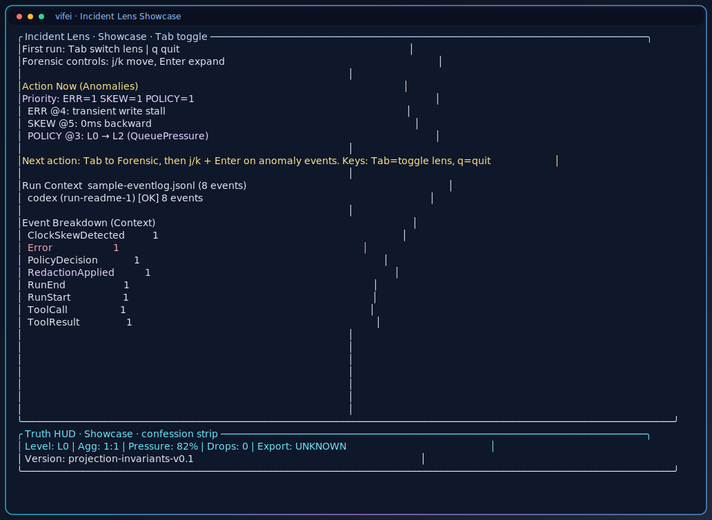
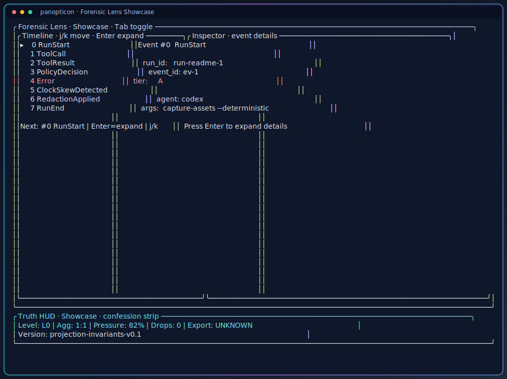
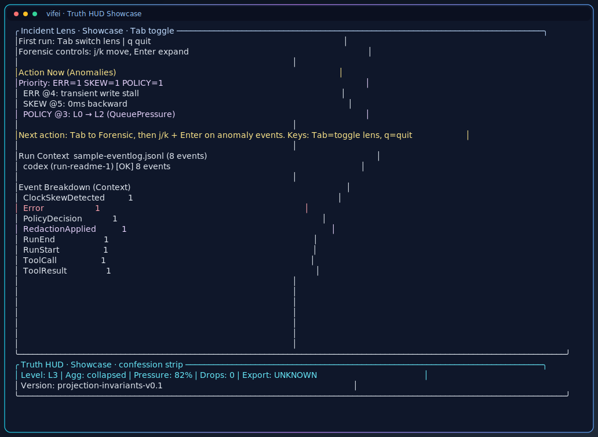
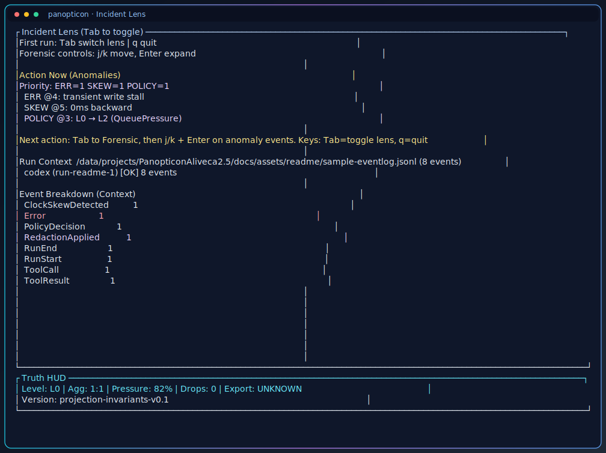
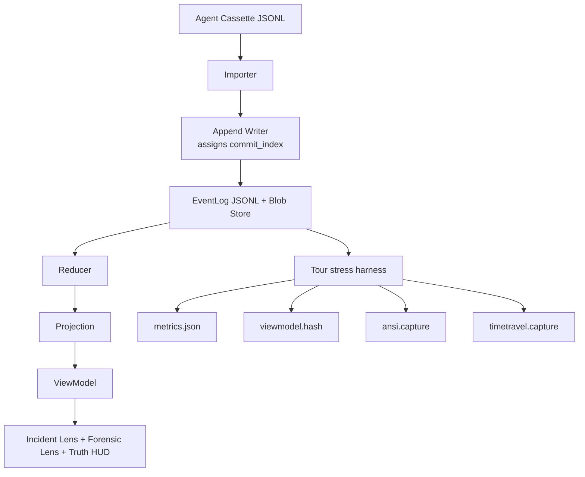

# Vifei Suite

[](https://github.com/yuan-cloud/vifei-suite-public/actions/workflows/ci.yml)
[](LICENSE)

Deterministic, local-first run evidence for AI agent workflows.

Vifei records canonical run truth as an append-only EventLog, then projects that truth into operator views and proof artifacts you can rerun and verify.

Presentation showcase: `docs/showcase/index.md`

## First-Screen Product Vibe

Trust-first cockpit with deterministic proof surfaces:







Quick launch commands:

```bash
scripts/demo/trust_demo_cut.sh /tmp/vifei_trust_cut fixtures/small-session.jsonl
scripts/demo/visual_showcase_cut.sh /tmp/vifei_visual_cut
scripts/demo/package_launch_bundle.sh .tmp/launch-media-bundle
```

## At a Glance

- Deterministic replay evidence you can rerun and verify locally.
- Incident-first and forensic-first views with an always-visible Truth HUD.
- Share-safe export that fails closed with explicit refusal reports.

## Why This Exists

Most agent workflows have logs but weak replay guarantees under stress. Vifei keeps truth auditable when pressure rises.

- Canonical ordering uses `commit_index` from one append writer.
- Truth stays intact under overload; only projection quality degrades.
- Share-safe export refuses unsafe bundles and emits explicit refusal reports.

## Why This Matters for Revenue Ops

Teams lose deals when execution context is fragmented across tools and people. Vifei demonstrates an engineering posture that keeps operational workflows fast and trustworthy.

- Faster root-cause analysis for stalled workflow states through deterministic replay.
- More consistent follow-through with explicit, inspectable run evidence.
- Safer automation boundaries with fail-closed export and refusal diagnostics.

## 60-Second Quickstart

1. Run deterministic stress Tour:

```bash
cargo run -p vifei-tui --bin vifei -- tour fixtures/large-stress.jsonl --stress --output-dir tour-output
```

2. Confirm proof artifacts:

```bash
ls -1 tour-output
cat tour-output/viewmodel.hash
cat tour-output/metrics.json
```

3. Optional human-readable CLI surface check:

```bash
cargo run -p vifei-tui --bin vifei -- --human --help
```

Expected artifact files:

- `metrics.json`
- `viewmodel.hash`
- `ansi.capture`
- `timetravel.capture`

## Trust Signals (What You Can Verify Yourself)

| Claim | How to verify |
|---|---|
| Replay determinism | Run Tour twice and compare `viewmodel.hash` |
| Tier A truth protection | Confirm `tier_a_drops` is `0` in `metrics.json` |
| Share-safe export posture | Run export with `--share-safe`; inspect refusal report behavior |
| Constitutional alignment | Run `cargo test` (`docs_guard` enforces constitutional drift checks) |

## Core Workflows

### Desktop operator flow (full triage)

Use this path during active investigation on a full terminal.

- Human CLI adapter track (operator-readable snippets): `docs/showcase/adapter-human-cli-track.md`
- Robot JSON adapter track (automation snippets + contract expectations): `docs/showcase/adapter-robot-json-track.md`
- Refusal and safety adapter track (security and governance proofs): `docs/showcase/adapter-refusal-safety-track.md`

### Determinism check (rerun hash)

```bash
cat tour-output/viewmodel.hash
cargo run -p vifei-tui --bin vifei -- tour fixtures/large-stress.jsonl --stress --output-dir tour-output-rerun
cat tour-output-rerun/viewmodel.hash
```

Expected result: both hash files match.

Shortcut demo script:

```bash
scripts/demo/determinism_duel.sh --fast
```

Use `--full` for stress-grade replay duel.

### View an EventLog in TUI

```bash
cargo run -p vifei-tui --bin vifei -- view docs/assets/readme/sample-eventlog.jsonl
```

Run in a real interactive terminal (TTY).

### Mobile or narrow-screen proof scan

Use this path when you need high-signal proof checks quickly in limited width.

1. Run Tour and check hash + drops.
2. Run refusal radar for export safety proof.
3. Read the latest bakeoff report for one-file summary evidence.

```bash
scripts/demo/determinism_duel.sh --fast
scripts/demo/refusal_radar.sh --fast
cat .tmp/competitor-bakeoff/run-*/bakeoff-report.json
```

### Showcase profile (visual demo mode)

```bash
cargo run -p vifei-tui --bin vifei -- \
  view docs/assets/readme/sample-eventlog.jsonl --profile showcase
```

`showcase` only changes presentation chrome and emphasis; truth ordering and proof semantics remain unchanged.

### Showcase gallery

Incident Lens (standard):



Incident Lens (showcase):


Forensic Lens (showcase):


Truth HUD (showcase):


### Export with share-safe checks

```bash
cargo run -p vifei-tui --bin vifei -- export \
  docs/assets/readme/sample-export-clean-eventlog.jsonl \
  --share-safe \
  --output out/bundle.tar.zst \
  --refusal-report out/refusal-report.json
```

Refusal Radar demo script:

```bash
scripts/demo/refusal_radar.sh --fast
```

### Incident evidence pack (one command)

```bash
cargo run -p vifei-tui --bin vifei -- incident-pack \
  docs/assets/readme/sample-export-clean-eventlog.jsonl \
  docs/assets/readme/sample-export-clean-eventlog.jsonl \
  --output-dir out/incident-pack
```

This writes deterministic local artifacts (`compare/delta.json`, replay summaries, share-safe bundles, and `manifest.json`) and fails closed with `EXPORT_REFUSED` if scanner findings block export.

Input format flags for mixed-source comparisons:

```bash
cargo run -p vifei-tui --bin vifei -- incident-pack \
  fixtures/small-session.jsonl \
  docs/assets/readme/sample-export-clean-eventlog.jsonl \
  --left-format cassette \
  --right-format eventlog \
  --output-dir out/incident-pack
```

Manifest input labels are share-safe file labels (not absolute local paths).

### Deterministic run comparison

```bash
cargo run -p vifei-tui --bin vifei -- compare \
  docs/assets/readme/sample-export-clean-eventlog.jsonl \
  docs/assets/readme/sample-export-clean-eventlog.jsonl
```

Optional mixed-format compare:

```bash
cargo run -p vifei-tui --bin vifei -- compare \
  fixtures/small-session.jsonl \
  docs/assets/readme/sample-export-clean-eventlog.jsonl \
  --left-format cassette \
  --right-format eventlog
```

Exit behavior:
- `0` when no divergence is found
- `5` when divergences are found (`DIFF_FOUND` envelope in robot mode)

### Competitor bakeoff harness (objective proof demo)

```bash
scripts/demo/competitor_bakeoff.sh --fast
```

This produces a timestamped proof bundle under `.tmp/competitor-bakeoff/` with:
- determinism duel hash agreement
- refusal-report blocked-item evidence
- Truth HUD explainability token checks
- incident-pack artifact validation

### Proofs (latest full local run)

Run:

```bash
scripts/demo/competitor_bakeoff.sh --full
```

Inspect:

```bash
cat .tmp/competitor-bakeoff/run-*/bakeoff-report.json
```

Latest run summary (`2026-02-18T22:36:20Z`):
- determinism hash agreement: `000573091386a86cabe6935bbe997897a83f42cf89595238e55c2f9c8d45eda6`
- refusal semantics: `blocked_count=4`
- explainability tokens present: `Level`, `Agg`, `Pressure`, `Drops`, `Export`, `Version`
- incident pack artifacts validated: `manifest.json` and `compare/delta.json`

### Final verification evidence bundle

Generate governance + demo evidence in one place:

```bash
mkdir -p .tmp/final-audit
scripts/testing/check_bead_closure_evidence.py \
  --audit-output-json .tmp/final-audit/bead-risk-parity.json \
  --audit-output-markdown .tmp/final-audit/bead-risk-parity.md
scripts/testing/validate_defer_register.py docs/testing/defer-register-v0.1.json
scripts/testing/check_coverage_contract.sh
scripts/testing/demo_smoke.sh .tmp/final-audit/demo-smoke
```

Primary outputs:
- `.tmp/final-audit/bead-risk-parity.json`
- `.tmp/final-audit/bead-risk-parity.md`
- `.tmp/final-audit/demo-smoke/duel/*/viewmodel.hash`
- `.tmp/final-audit/demo-smoke/radar/refusal-report.json`
- `.tmp/final-audit/demo-smoke/bakeoff/*/bakeoff-report.json`

### Live Incident Wall assets

```bash
scripts/demo/live_incident_wall.sh --fast
```

This prepares premium showcase wall assets under `docs/assets/readme/`.

### Record a showcase cast

```bash
scripts/capture_showcase_cast.sh --fast /tmp/vifei-showcase-cast
```

Requires `asciinema`; output is a replayable `.cast` file for launch/demo channels.

### Robot mode for AI agents

Use machine-readable mode for automation:

```bash
cargo run -p vifei-tui --bin vifei -- \
  --json tour fixtures/large-stress.jsonl \
  --stress --output-dir tour-output
```

Behavior contract:

- `--json` returns compact structured output for success and errors.
- When stdout is piped, CLI auto-switches to JSON (unless `--human` is set).
- Error payloads include `code`, `message`, and `suggestions`.
- Parser authority is explicit: `clap` owns subcommand aliases and parse semantics.
- Normalization is bounded to known option spelling repairs and never rewrites positionals (including after `--`).

Force human-readable output even when piping:

```bash
cargo run -p vifei-tui --bin vifei -- \
  --human --help
```

Strict trust verification command:

```bash
cargo run -p vifei-tui --bin vifei -- \
  --json verify --strict --full --output-dir verify-output
```

This emits a single structured result that checks determinism stability, Tier A drop safety, refusal semantics, and explainability token presence.

Robot JSON contract keys (`schema_version=vifei-cli-robot-v1.1`):

| Key | Type | Notes |
|---|---|---|
| `schema_version` | string | Contract version for parsers |
| `ok` | bool | Success/failure discriminator |
| `code` | string | Stable status code (`OK`, `INVALID_ARGS`, `NOT_FOUND`, `EXPORT_REFUSED`, `RUNTIME_ERROR`, `DIFF_FOUND`) |
| `message` | string | Human-readable summary |
| `suggestions` | array[string] | Actionable next commands or hints |
| `exit_code` | number | Process exit code mirror |
| `data` | object | Success payload (present on success envelopes) |
| `notes` | array[string] | Optional normalization notes when intent-repair was applied |

Exit codes:

- `0`: success
- `1`: not found
- `2`: invalid args
- `3`: export refused (share-safe scanner refusal)
- `4`: runtime error
- `5`: diff found (compare divergence)

## Architecture Snapshot



Workspace crates:

- `crates/vifei-core`: event schema, append writer, reducer, projection
- `crates/vifei-import`: Agent Cassette importer
- `crates/vifei-export`: bundle export and share-safe scanning
- `crates/vifei-tour`: stress harness and proof artifact emission
- `crates/vifei-tui`: CLI and terminal UI lenses

## Governance Docs

- `docs/CAPACITY_ENVELOPE.md`
- `docs/BACKPRESSURE_POLICY.md`
- `docs/UX_SCOPE.md`
- `docs/UX_MODALITY_MATRIX.md`
- `docs/UX_VISUAL_TONE.md`
- `docs/PUBLIC_REPO_SETTINGS_CHECKLIST.md`
- `PLANS.md`

## Community and Security

- `CONTRIBUTING.md`: contribution expectations and report quality checklist
- `SUPPORT.md`: support channels and triage priorities
- `SECURITY.md`: private vulnerability reporting policy
- `docs/COMMUNITY_TRIAGE_PLAYBOOK.md`: maintainer triage and severity flow
- `.github/ISSUE_TEMPLATE/`: issue intake forms for bug and determinism reports
- `.github/pull_request_template.md`: PR evidence and risk template

## Status

Vifei v0.1 implements the core truth pipeline. Release and public documentation work continues.

## Development

```bash
cargo fmt --check
cargo clippy --all-targets -- -D warnings
cargo test
```

## Troubleshooting

### `--stress flag is required`

`tour` intentionally refuses non-stress mode in v0.1. Add `--stress`.

### `Export without secret scanning is not supported`

`export` requires `--share-safe`.

### Tour hash mismatch across reruns

Treat as determinism regression. Re-run on an idle machine, then inspect recent reducer/projection changes.

### `view` fails on fixture path

`view` expects EventLog JSONL, not Agent Cassette fixture JSONL.

## README Assets

Reference captures and visuals live under `docs/assets/readme/`:

- `docs/assets/readme/incident-lens.txt`
- `docs/assets/readme/incident-lens.svg`
- `docs/assets/readme/incident-lens-showcase.txt`
- `docs/assets/readme/incident-lens-showcase.svg`
- `docs/assets/readme/forensic-lens.txt`
- `docs/assets/readme/forensic-lens.svg`
- `docs/assets/readme/forensic-lens-showcase.txt`
- `docs/assets/readme/forensic-lens-showcase.svg`
- `docs/assets/readme/truth-hud-degraded.txt`
- `docs/assets/readme/truth-hud-degraded.svg`
- `docs/assets/readme/truth-hud-showcase.txt`
- `docs/assets/readme/truth-hud-showcase.svg`
- `docs/assets/readme/export-refusal.txt`
- `docs/assets/readme/architecture.mmd`

Refresh deterministically:

```bash
scripts/refresh_readme_assets.sh
```
